# 🧩 Flutter Pokédex

[](https://github.com/AkhmadRamadani/pokedex/stargazers)
[](https://github.com/AkhmadRamadani/pokedex/blob/main/LICENSE)
[](https://github.com/AkhmadRamadani/pokedex/network/members)
[](https://github.com/AkhmadRamadani/pokedex/issues)

A beautifully crafted Flutter application that displays Pokémon data with features such as favorites, search/filter, and persistent local storage. This project utilizes modern Flutter development tools including `provider`, `auto_route`, `injectable`, and `hive`, with full support for dark and light themes.

## ✨ Features

- ⚙️ Modular structure for better scalability and maintainability
- 🌙 Light and Dark Theme support
- 🧩 State Management using [`provider`](https://pub.dev/packages/provider)
- 🚦 Route management via [`auto_route`](https://pub.dev/packages/auto_route)
- 💉 Dependency Injection with [`injectable`](https://pub.dev/packages/injectable)
- 💾 Local data persistence with [`hive`](https://pub.dev/packages/hive)
- 🧠 Offline capability for favorite Pokémon and recent filters

## 📸 Screenshots

Here are some screenshots of the app:

<p align="center">
  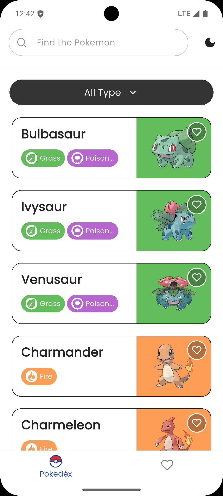
  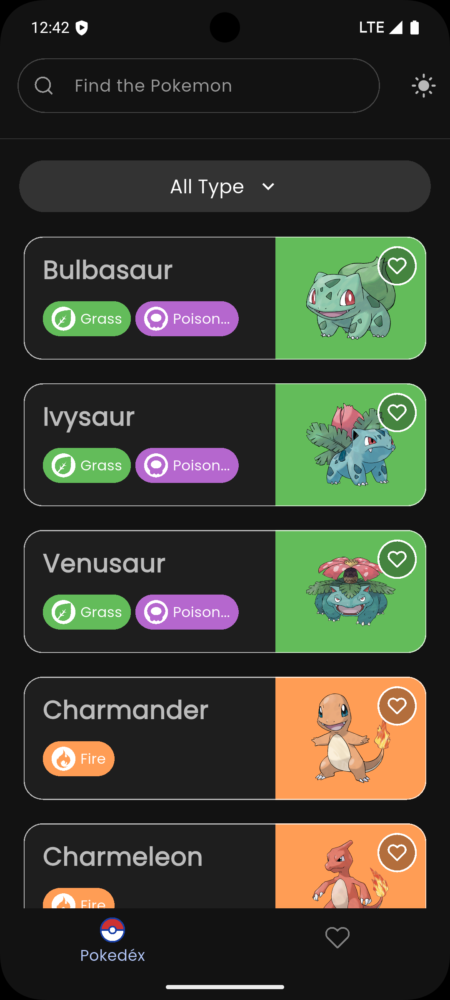
  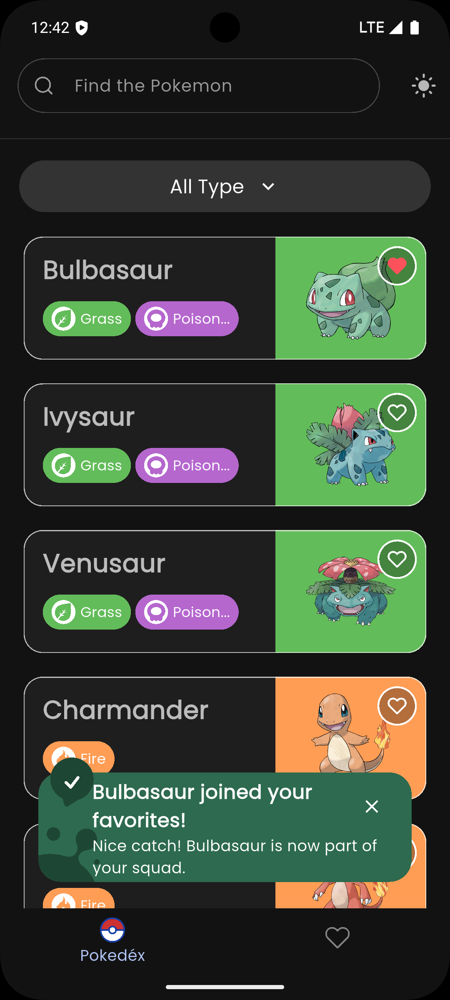
  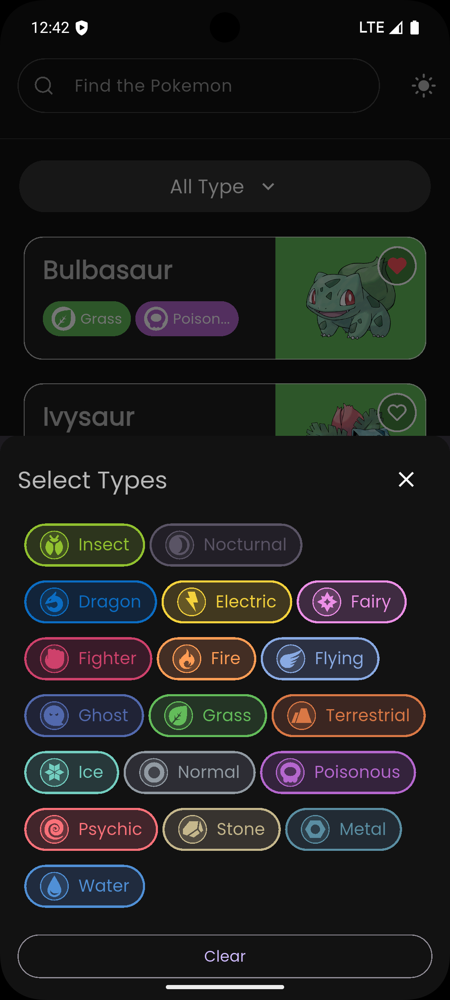
  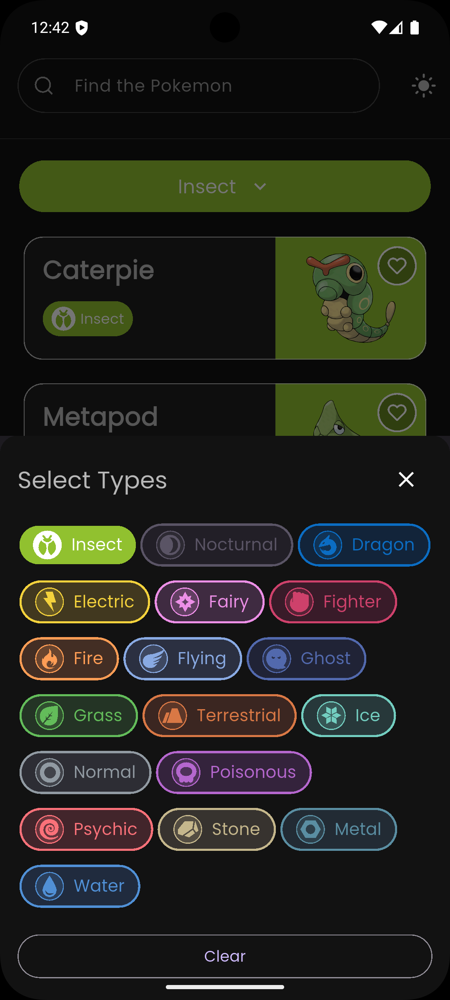
  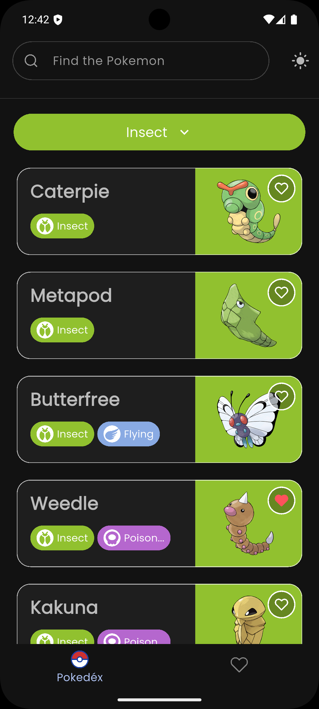
  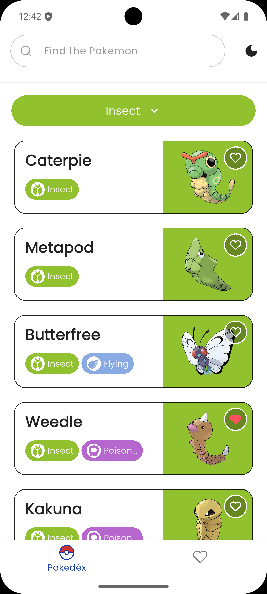
  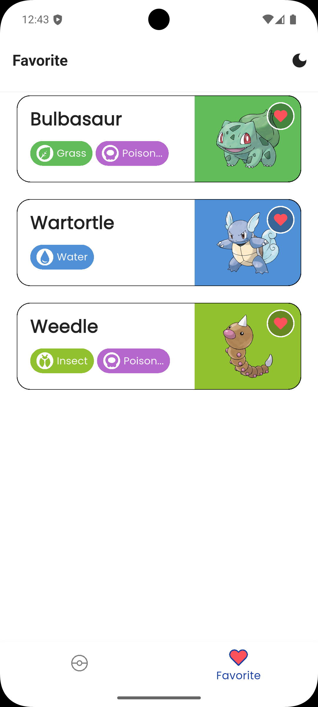
  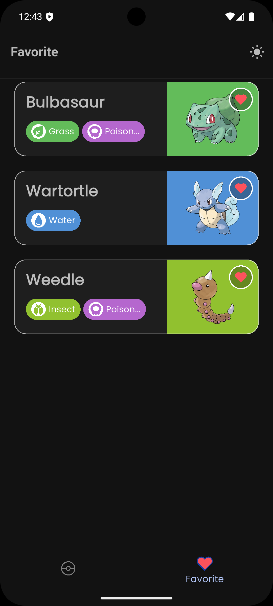
  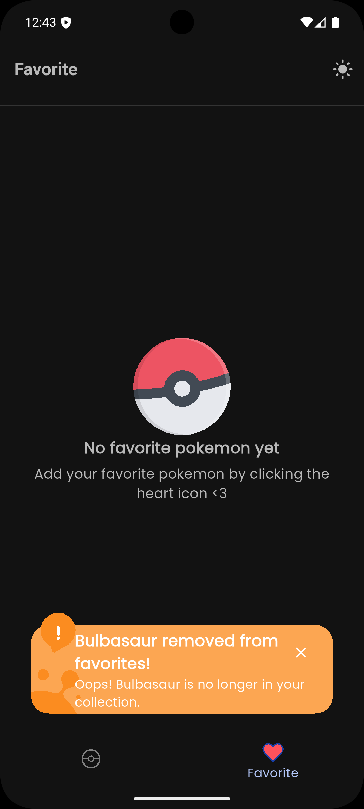
  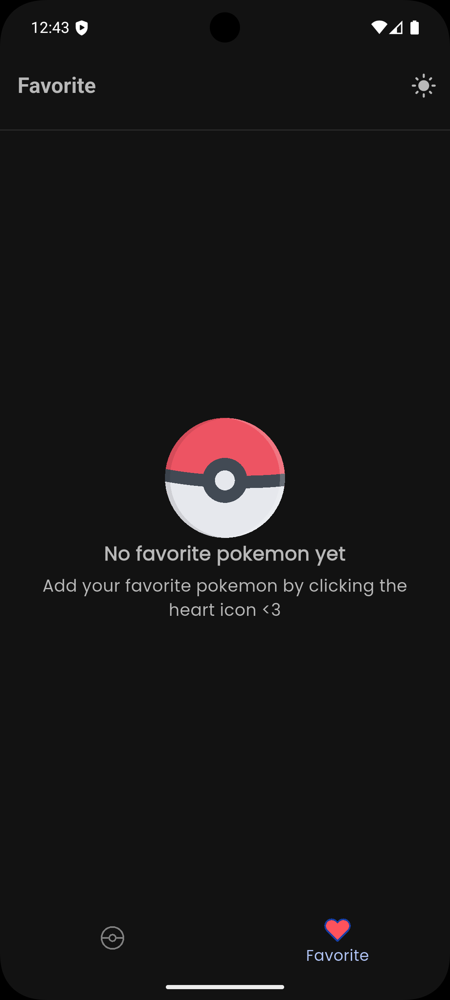
  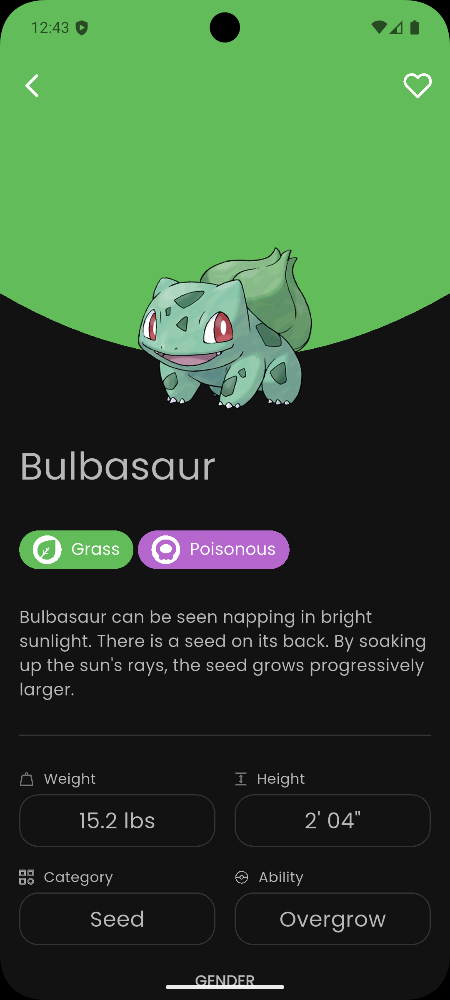
  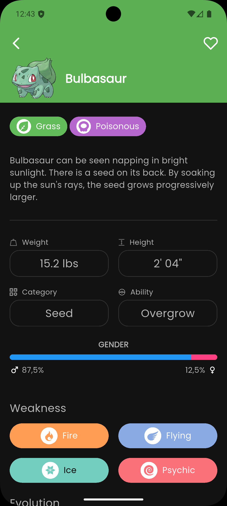
  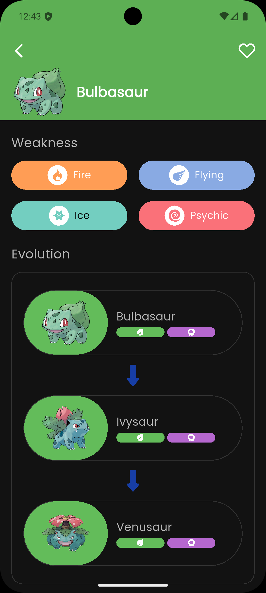
  
  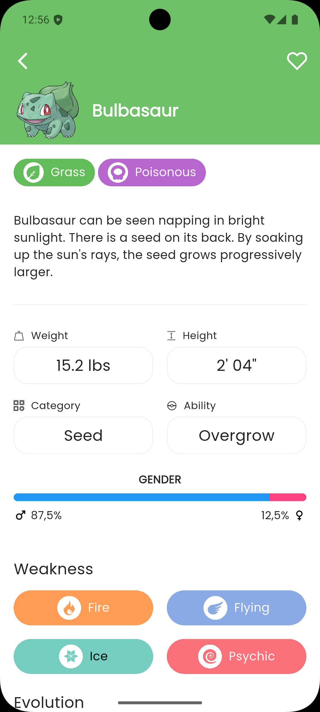
  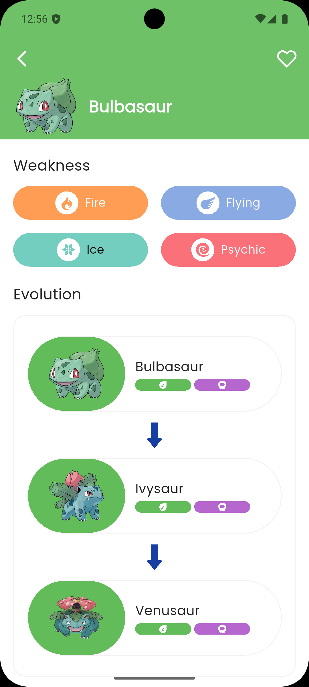
</p>


## 🚀 Getting Started

1. **Clone the repository**

   ```bash
   git clone https://github.com/AkhmadRamadani/pokedex.git
   cd pokedex
   ```

2. **Install dependencies**

   ```bash
   flutter pub get
   ```

3. **Generate files (routes, injection)**

   ```bash
   flutter pub run build_runner build --delete-conflicting-outputs
   ```

4. **Run the app**

   ```bash
   flutter run
   ```

## 📁 Folder Structure

```
lib/
├── core/                 # Core utilities and shared configuration
│   ├── assets/           # Static assets and generated files
│   ├── config/           # Route and DI configuration
│   ├── constants/        # Global constants (e.g. API)
│   ├── databases/        # Hive-related models and services
│   ├── extensions/       # Dart/Flutter extension methods
│   ├── helpers/          # Utility helpers (e.g. error handling)
│   ├── services/         # Low-level services like network
│   ├── shared/           # Shared models and widgets
│   ├── state/            # UI state definition using Freezed
│   └── themes/           # Light/Dark themes and color config
├── modules/              # Feature-based modules (Pokedex, Favorite, etc)
│   ├── splash/           # Splash screen
│   ├── home/             # Home view
│   ├── pokedex/          # Pokedex feature
│   ├── favorite/         # Favorite Pokémon feature
│   └── detail/           # Pokémon detail feature
├── main.dart             # App entry point
├── pokedex\_app.dart      # Root widget of the app
├── pokedex\_provider.dart # Root provider setup
└── hive\_registrar.g.dart # Hive adapter registrations
```

## 📦 Hive Boxes

* Pokémon List
* Favorite Pokémon

## 🌙 Theme Support

App will automatically switch between light and dark themes based on system settings. You can also customize themes within the app.

## 📌 Notes

* Ensure you run `build_runner` every time you change route or injectable-related files.
* Hive adapters are already registered via the injectable DI setup.

## 📄 License

MIT License © Akhmad Ramadani 

